# DQN_Move_Object

Please install the required libraries listed in the `requirements.txt` file. The script for the projects first part
is in the `hw2_1.py` file and the second part, with minimal architectural changes, is in the `hw2_2.py` file.
`train` functions are used to train the DQN model structure with the given hyper parameter sets. It saves the checkpoints after each
500 episodes and after each episode, it saves the model metrics to the mlflow environment. You can run the `mlflow ui` command to run
the ui in the localhost to get momentary changes. It also saves the pyplot graphs to the `visuals` directory. I manually selected
the best model from best runs according to their rps and total reward values. The `test` functions create experimental runs and
record the rps and total reward values as bar plots into the `evaluation` directory. It also runs the environment in `gui` mode
to better visualization and understanding of the behaviour of the trained models.

## Part 1

In this part, I experimented with the proposed model and hyper parameter set but I couldn't get
converging results even after several experiments with different minimal hyper parameter changes. Each run with 10,000 episodes with 100 steps each took 14 hours each. The changed model
structure and best hyper parameter set can be found in the `hw2_1.py` file. I used two heads in the model
structure one for to estimate the reward for each action and the other one for scaling the found results with the given state encoding.
Also, I used tau hyper parameter to reserve small portions of the target network in each update operation.

The MSE loss values for each episode can be seen from the below graphs. Top graph shows the actual values and the bottom one shows the
smoothened values. As it is seen, the loss increased gradually with each episode. In some of the experiment runs, I was able to create a
loss value graph which decreased with a stable manner. But, in the best performing experiment, the loss value gradually increased and I couldn't resolve it.

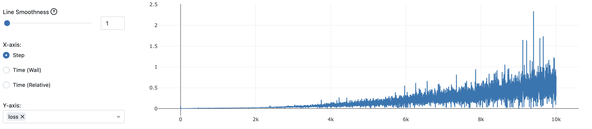
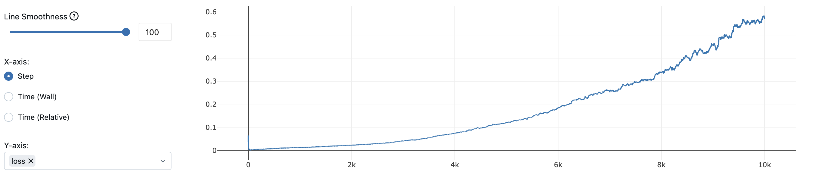

Below graphs show actual and smoothened values of the total rewards for each episode. The graphs show that the model increased the gained total reward
even it fluctuates in between each episode. But the increase in the total reward slows down after the 2000 episodes and nearly stops after 7000 episodes. 

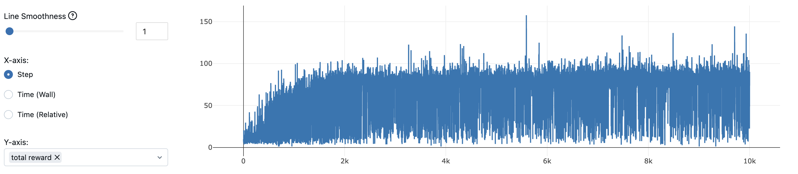
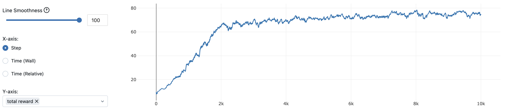

The graphs below show the rps actual and smoothened values for each episodes. It shows parallel results with the total reward graphs.

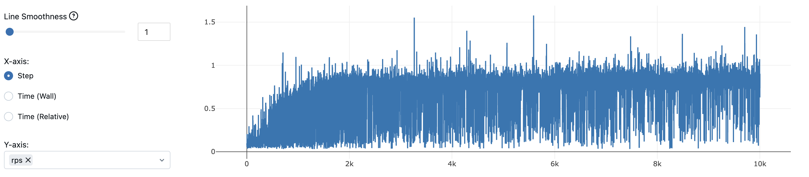
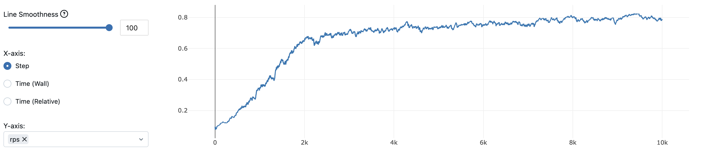

After running the `test` function with the `hw2_1.pth` trained model parameter file, I made 5 experimental episodes. Each episode showed
very similar behaviours. Even though the total reward gained from the experiment 1 seems very low, when we see regarding rps value, we can see that
each run results with similar reward values. 

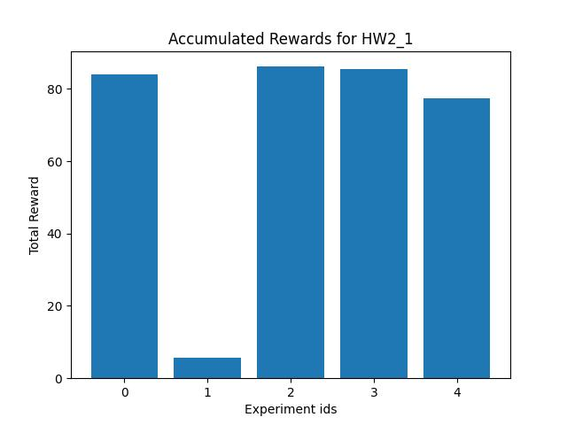

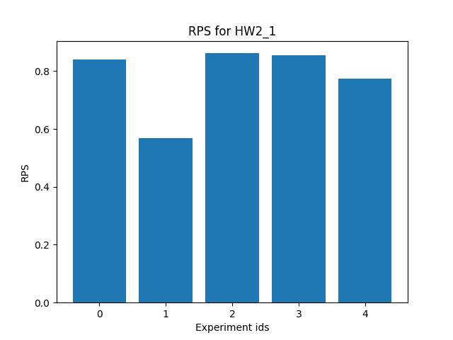

Because I run the simulation environment with the `gui` parameter, I could capture the behaviour of the robot arm as it seen from the below gif.
There were two significant scenarios. In most of the cases, the arm goes to the red object and tries to move it, but gets stuck at some point. In other cases
the arm can successfully moves the object to the goal position. You can see both scenarios from the below gif.

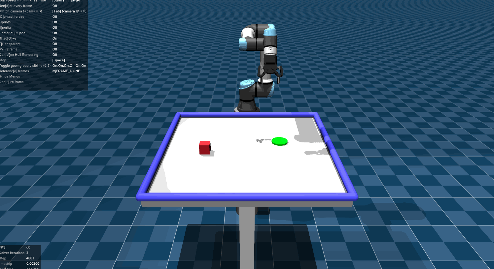

## Part 2

In this part, I used the proposed model structure and hyperparameter set to train a DQN model
which takes the state information as the image taken from a camera and makes a next action reward
predictions. Training 10,000 episodes with 100 steps each took me 19 hours with Mac M2 Max chip.

I used mlflow to capture the plots in more dynamic way so that I could compare the model performance in between different experiment runs.
The provided scrips also produces pyplot plots to show these value graphs after finishing the experiment run in the `visuals` directory.

Below graphs show changes on the MSE Loss value in each step. As it is seen, the loss values are gradually increasing in this experiment.
I couldn't resolve the underlying reason for this because I couldn't run comprehensive experiments due to the hardware and time limitations.
Top graph shows the actual loss values and the below one shows the smoothed version.

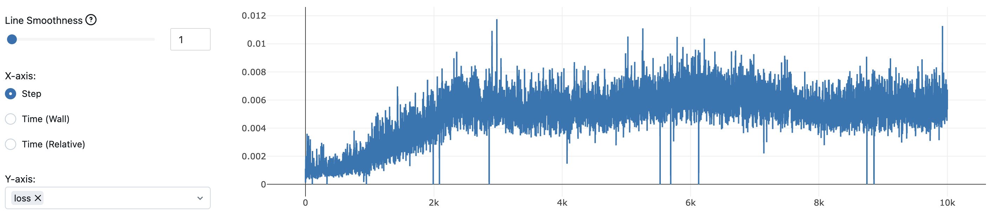
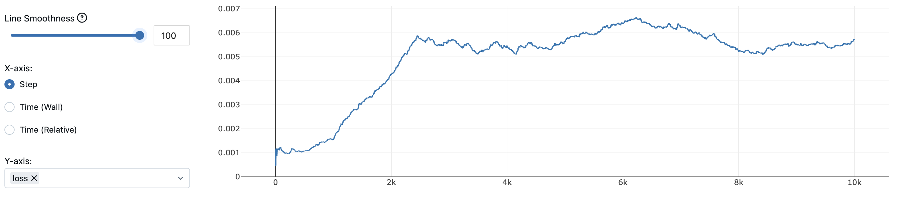

Below graphs show the accumulated reward values for each step. Top is the actual values and the bottom is the smoothened 
version. As it is seen, it greatly fluctuates and it continues to increase even after 10,000 episodes. So maybe, increasing the
episode count may help to get better results.

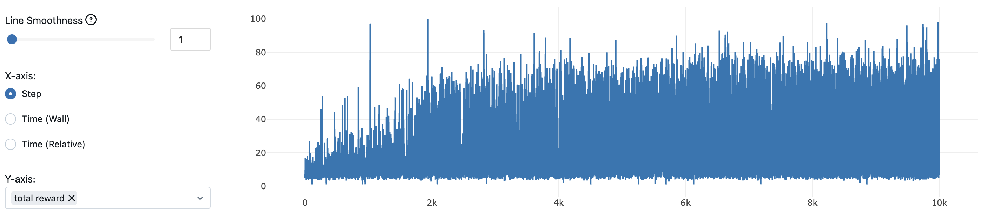
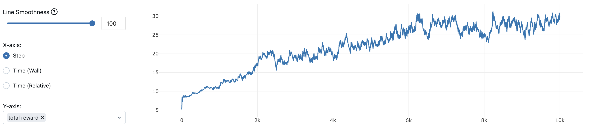

Below graphs show the reward per step. Top is the actual values and the bottom is the smoothed version. As it is seen, it shows
parallel behaviours with the accumulated reward graphs. I used 100 maximum steps per episode.

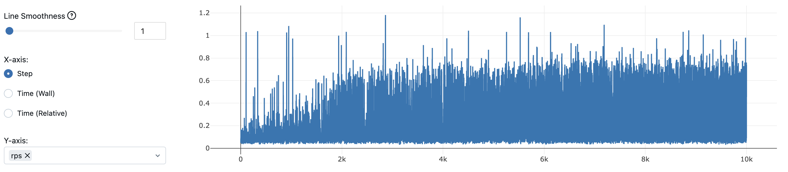

The `test` function takes the selected model parameters and makes the next action predictions according to the expected
rewards from the possible actions. With the most probable action (or random action with epsilon=0.05), takes the next state
and continues to iterate in the simulation environment. It saves gathered reward and rps graphs into the `evaluation` directory.

The total reward and rps values for the randomly selected 5 runs:

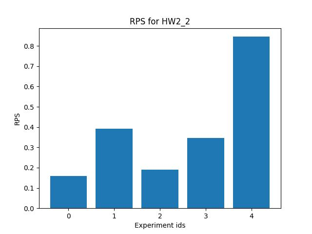

I also run the environment in the `gui` mode and selected mostly appearing 2 cases and saved it as a gif.
As it is seen, in some of the scenarios, the arm successfully moves to the red cube but is not capable to the
move it to the goal position. In other scenarios, the arm gets paralyzed and can not make a proper decision on how to take the next action and
repeats the current state again and again.

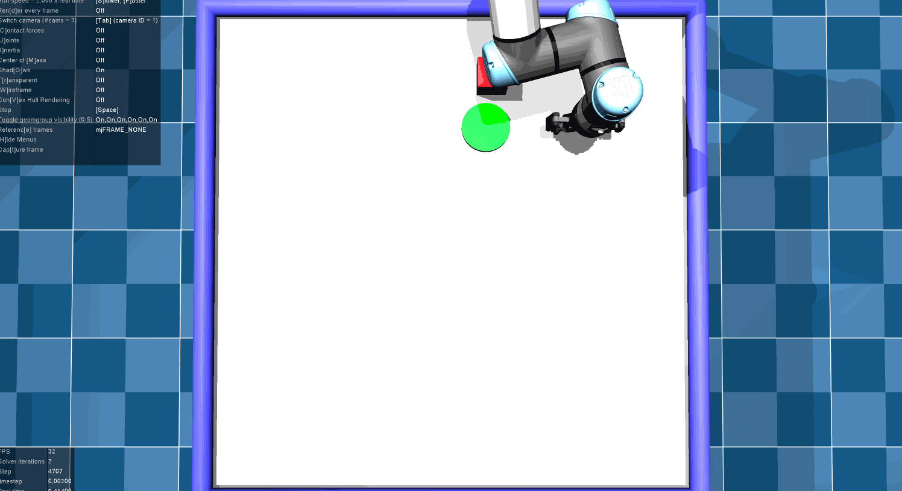
